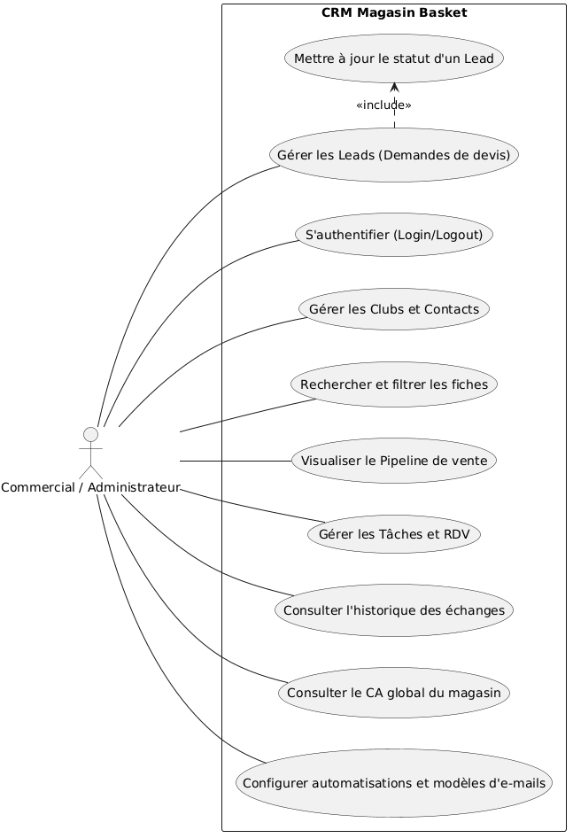
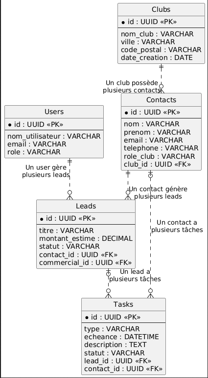

# 🏀 CRM Magasin Basket - Architecture Headless

Ce projet est une application web CRM sur-mesure développée pour centraliser les données clients (clubs de basketball) et fluidifier le suivi des opportunités commerciales.

## ✨ Fonctionnalités Principales

**Tableau de Bord Analytique :** Calcul en temps réel du Chiffre d'Affaires réalisé et prévisionnel, et affichage des tâches urgentes.

**Répertoire Dynamique :** Gestion des Clubs et Contacts avec filtres en temps réel et envoi d'emails transactionnels en un clic via l'API Resend.

**Pipeline Commercial (Kanban) :** Suivi visuel des devis sur 4 colonnes (Nouveau, En négociation, Gagné, Perdu) avec calcul automatique des montants.

**Gestionnaire de Tâches :** Suivi interactif des actions à réaliser (appels, RDV, emails) sans rechargement de page.

**Portail de Sécurité :** Authentification bloquant l'accès aux utilisateurs non connectés, avec gestion sécurisée des sessions via Supabase Auth (JWT).

## 🛠️ Architecture Technique & Stack

Le projet repose sur une architecture moderne de type API "Headless", avec une séparation stricte entre le Frontend et le Backend.

**Frontend (Interface) :** Développé en React / Next.js (TypeScript) pour des performances optimales, stylisé avec Tailwind CSS et hébergé sur Vercel.

**Backend (API) :** Développé en Python (Django & Django REST Framework), exposé sur le port 8080 et déployé en conteneur (Docker) sur Fly.io avec gestion native IPv6.

**Base de données :** PostgreSQL hébergé sur le cloud via Supabase.

**CI/CD :** Déploiement continu automatisé via GitHub vers Vercel et Fly.io.

## 📊 Modélisation et Diagrammes

**Cas d'Utilisation :** Le système distingue les rôles "Commercial" (gestion des leads, tâches, etc.) et "Administrateur" (supervision du CA global, gestion des utilisateurs, configuration marketing).

**Modèle Conceptuel de Données (MCD) :** Base normalisée garantissant l'intégrité des données grâce à des identifiants uniques (UUID) pour les entités clés : Users, Clubs, Contacts, Leads et Tasks.

## 🚀 Workflow et Sécurité

**Flux de données :** Les requêtes HTTP sont gérées par Axios. Lors d'une action utilisateur, le Frontend structure la requête, le Backend la valide selon la logique métier en Python, puis interroge la base PostgreSQL avant de renvoyer le succès de l'opération.

**Sécurisation CORS :** Le backend Django est configuré pour n'accepter que le trafic HTTP provenant exclusivement de l'URL de production du frontend.

* **Gestion des Secrets :** Aucune donnée sensible n'est stockée sur GitHub. Les variables d'environnement sont injectées dynamiquement et de manière chiffrée depuis Fly.io et Vercel.